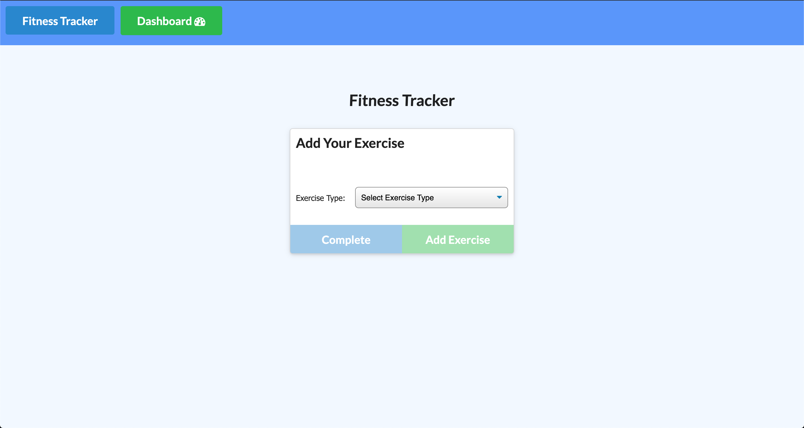

# Fitness Tracker

# Link to Application
[VIEW MY APPLICATION HERE!]()

## Table of Contents

* [Description](#Description)
* [Author](#Author)

## Description

An application to view, create and track daily workouts. It allows the user to track the name, type, weight, sets, reps, and duration of the exercise. If the exercise is a cardio exercise, the user can track the distance traveled. The application is built using mongoose a module of MongoDb, Express and morgan modules.  

## Author

**Christopher Hicks**

- Github: [chris31roc](https://github.com/chris31roc)

- Email: chris31roc@yahoo.com

# burger-buns

* [github](#github)

* [email](#email)

* [title](#title)

* [description](#description)

* [reason](#reason)

# Github
[chris31roc](https://github.com/chris31roc)

# E-Mail
[E-Mail me to connect for fast response](chris31roc@yahoo.com)

## Title
# Burger Buns

# Description
Burger Buns is a restaurant app that lets users input the names of burgers they'd like to eat.

# Link to Application
[VIEW MY WORK HERE!]()